## Aloy 

Aloy (https://www.getaloy.in) is a loyalty platform for the ONDC network built using Solana for the future of e-commerce in India. 

Today, the 370,000+ sellers on ONDC do not have rewards and promotions infrastructure to retain loyal customers and attract new ones. For the customers, the current loyalty systems are too fragmented - It is very difficult to keep track of different kinds of points being given by different sellers and brands in the market. On top of that, it takes a long time to accumulate sufficient points for a meaningful reward (if any). 

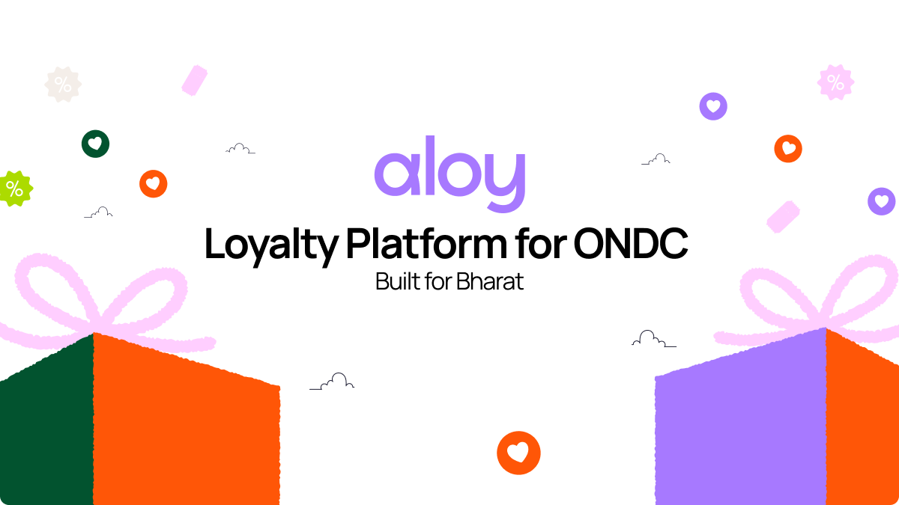

The Aloy SDK helps any seller on the network to enable loyalty programs for their customers. The Aloy app helps end users track loyalty points for every purchase on the network irrespective of the purchase touchpoint.

> **_NOTE:_** Note: This prototype is currently built for the Food & Beverage segment (particularly restaurants that serve online orders). This is just the beginning though - ONDC has penetrated multiple categories (Travel, Finance, Hospitality, etc.) and Aloy would work for all types of sellers and service providers on the network.

## ONDC 
ONDC(https://ondc.org/), or Open Network for Digital Commerce, is a government initiative in India aimed at creating a unified digital commerce infrastructure. It seeks to standardize and streamline processes for businesses, enabling seamless integration and interoperability across various digital platforms. ONDC aims to foster innovation, improve access to markets, and enhance the overall efficiency of the digital commerce ecosystem in India.

ONDC is built on top of **Beckn Protocol**.

## Beckn Protocol

Beckn (short for beckn protocol) is an open protocol for decentralized commerce. It consists of several specifications for building open e-commerce networks across which sellers and their offers are universally discoverable from any Beckn-enabled app or platform. As a protocol, Beckn is multi-layered, with layer structure and organization resembling that of HTTP.

The Beckn Protocol is a collection of open specifications that deliver Beckn’s functionality. The specifications consist of protocol APIs, message formats, network design and reference algorithms, which allow multiple commercial service provider entities to bring their services together to offer one seamless integrated experience to their customers.

Beckn is a protocol, not a platform. It has a decentralized architecture that obviates the need for creating a centralized platform in order to integrate services from multiple providers simultaneously. The protocol ensures privacy and security by design by enabling secure, privacy-protected interactions.

The Interoperability protocol allows two entities in an integrated ecosystem to communicate with each other through structured flows and role definitions. The Server-To-Server Communication protocol allows any consumer-facing online platform to discover and transact with location-aware remote services with minimal implementation overhead. A single message packet generated at run-time, hence, could contain services from multiple providers.

## Network Actors

Following are the important components in the network:
- BAP or Beckn Application Platform
- BG or Beckn Gateway
- Registry
- BPP or Beckn Provider Platform

More details can be found here https://developers.becknprotocol.io/docs/introduction/transactional-layer/

## Aloy and ONDC

Aloy serves as a Technology Service Provider for Seller platforms built on ONDC who then offer the option for stores to implement Aloy's loyalty program. This allows Aloy to indirectly partner with stores. Users earn points on Aloy by making purchases across the ONDC network. They can the use these points to earn rewards and offers.

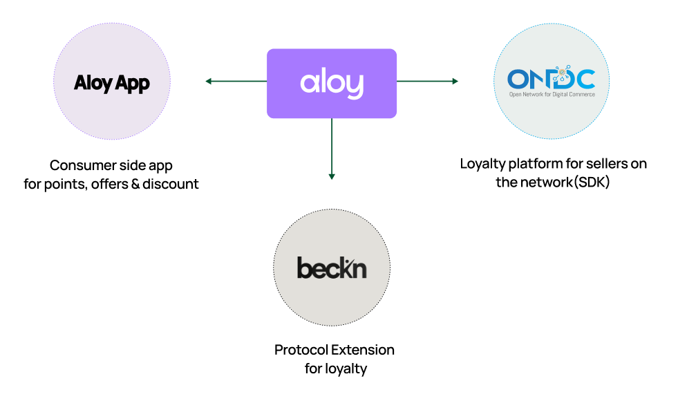

This project contains sample implementation of both BAP and BPP layers on the ONDC front. We have used the registry (https://registry.becknprotocol.io/login) and Gateway available in the developer ecosystem to register both the actors on the network. So inherently, for demonstration purposes, we have developed both the buyer and seller apps and registered them on the network, which means they communicate using Beckn protocol specs and are available on the registry. 

BAP:
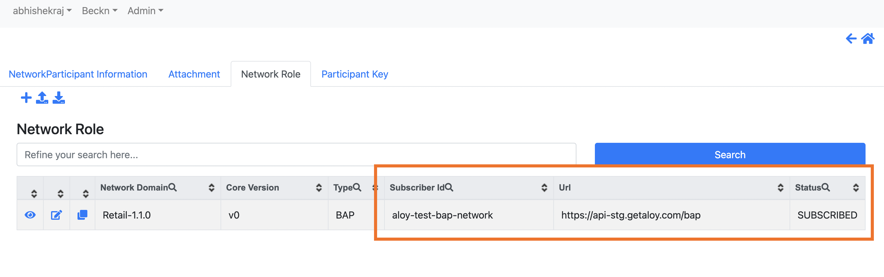

BPP:
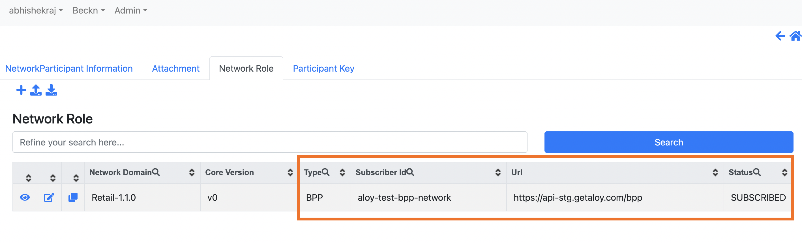

## Architecture

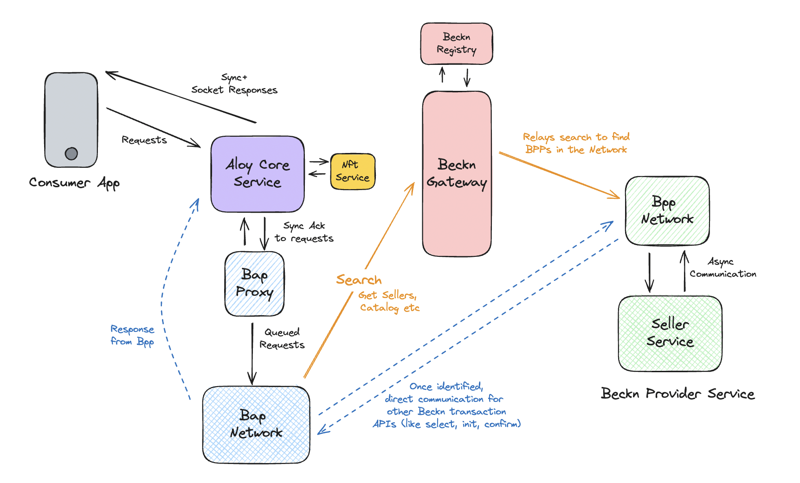

Let's take a quick look at the components:

- **Core app** - The heart of Aloy. The consumer app interacts with Core-app through HTTP and Socket communication. The ONDC network is async, so requests are received and ack'ed by core-app and responses are sent back via socket (when received).
- **NFT Service** - Handles everything related to onchain interactions. Receives requests from core-app and mints NFTs for users.
- **BAP-Proxy** - Acts as a bridge between the Core app and the BAP Netowrk layer, enabling seamless communication and data exchange between these two components.
- **BAP-Network** - Communicates with the Beckn Gateway to search for sellers in the network. It also talks directly to concerned BPP (async comms) for order related transactions (init, confirm, track, rating etc). It implements Beckn specs.
- **BPP-Network** - BPP Network is a service with a Beckn API implementation that accepts requests from Gateway or BAP and forwards them to the seller-service for fulfillment.
- **Seller-Service** - A prototype of a seller (restaurant) on network. Acts as an aggreagtor hosting multiple restaurants, maintains catalog and does order management. It is decoupled from BPP Network so as to separate business logic from Beckn specifications. It interacts with BPP Network asynchronously.

## The Flow

- Buyer signs up on the Aloy app, and looks up for a restaurant.

    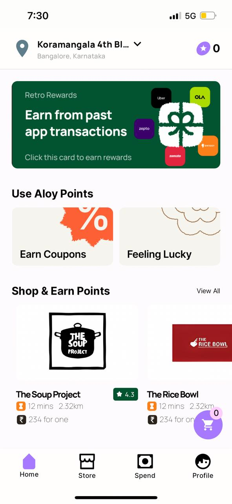

- This restaurant is currently hosted by the seller-service, and is discovered through the Beckn Gateway.

- Once discovered, the BAP and BPP network layers communicate with each other in an async way to initiate and place an order.

    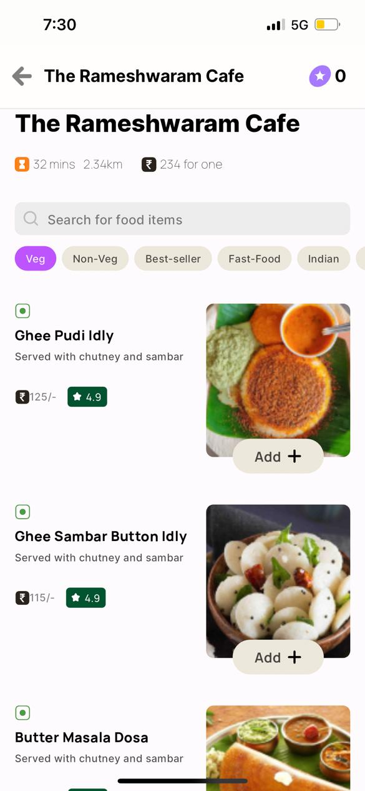

- Once a user places an order, they get **Aloy points**. These points are also updated on a profile Soulbound NFT on the Solana blockchain. Users can also get badges (NFTs) for different types of orders. For example, 10 Dosa orders in 1 month would get the user a **"Dosa Master"** badge.

    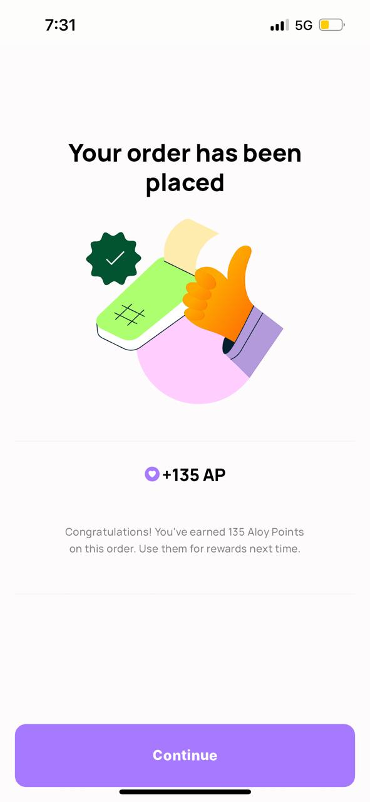 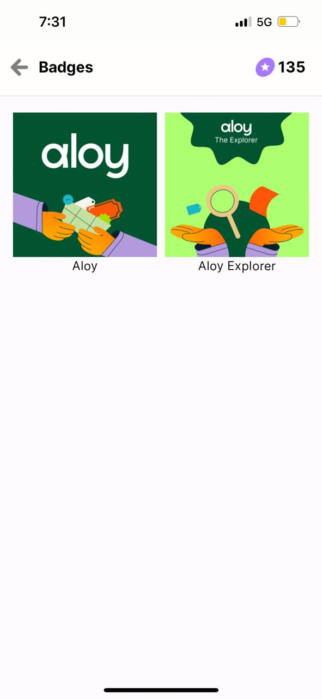

- Points and badges are available on-chain and can be used as proof of consumer behavior and build reputation in a decentralised world.

    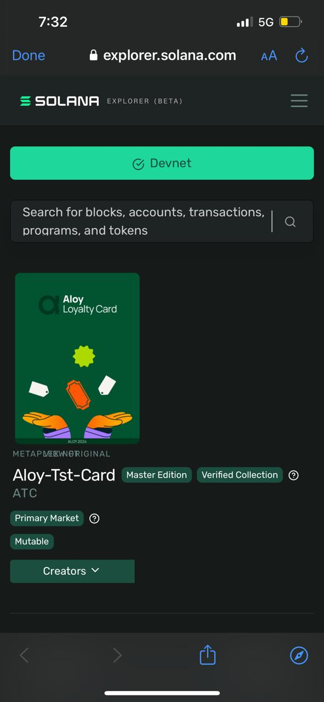 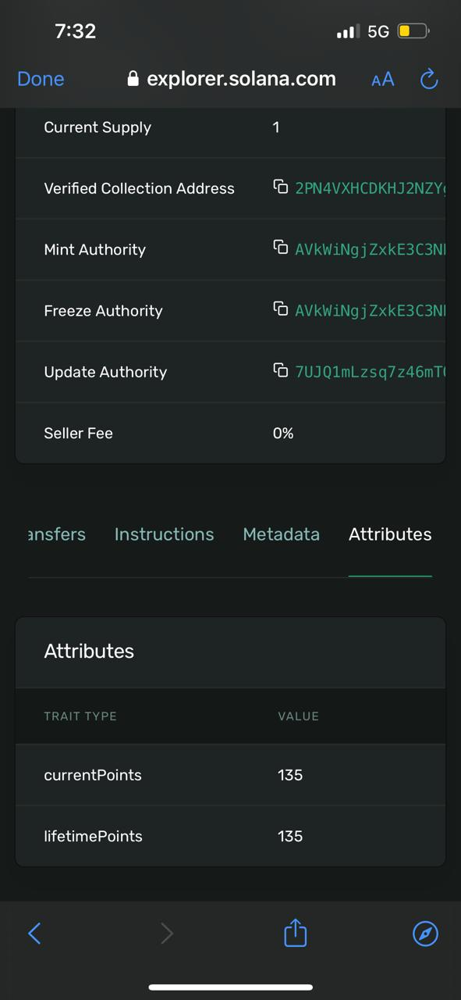  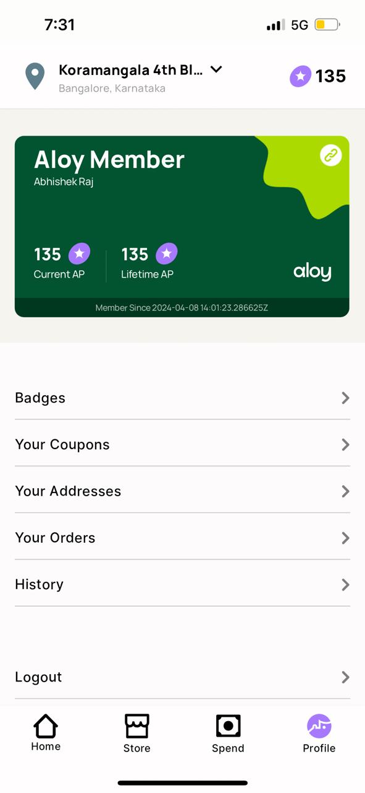

- Users can use these points to purchase coupons from the Aloy store. These coupons are then available to be auto-applied when the next order is placed with the restaurant.

    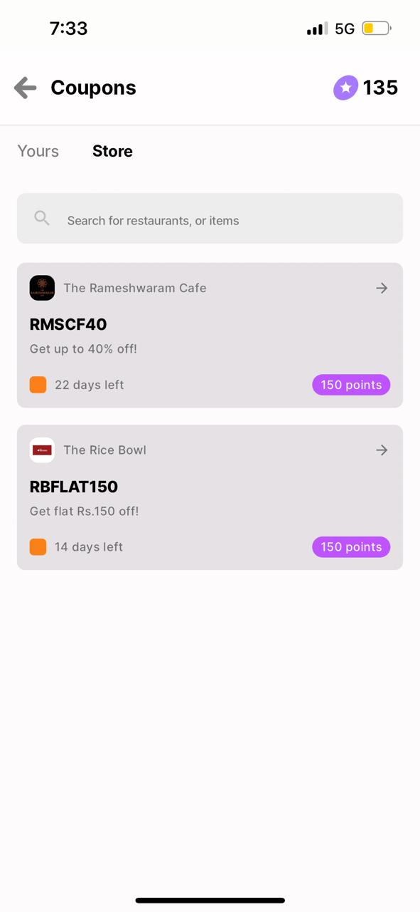 

> **_NOTE:_** The full app walkthrough video is available here - https://www.youtube.com/watch?v=rBwwuwoYDDQ&t=170s

## What next?

ONDC is still in its infancy and a lot of the infrastructure is yet to be built. Following are some ideas about what could be built on top of Aloy.

### Ratings and Review
A decentralised network needs a fair ratings and review system. Blockchain-backed Aloy badges and NFTs offer a great way to filter out fake reviews as well as promote genuine ones. For example, a veteran-shopper with 10K+ AP and a "Biryani King" Badge is comparatively more trustworthy for his review of a food place.

### Smart Ledger For ONDC
Metadata for transactions (non-PII) can be maintained on a Smart Ledger that drives the whole decentralized network. 

### Ad-bidding System

## Contributors

1. https://github.com/abhishekraj2506
2. https://github.com/arnxv0
3. https://github.com/ri-2020
4. https://github.com/vik-negi
