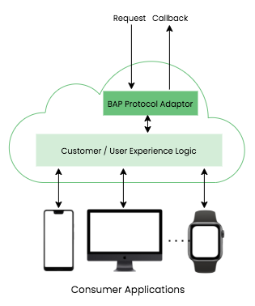
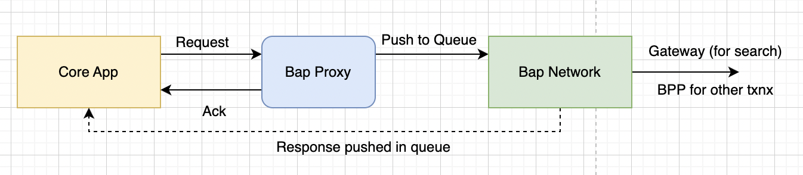

# BAP-Proxy

A Demand side Network actor in a Beckn-enabled network.

A Beckn Application Platform (BAP) is a consumer-facing infrastructure which captures consumers’ requests via its UI applications, converts them into beckn-compliant schemas and APIs at the server side, and fires them at the network. BAPs are the initiators of transactions and have the flexibility to communicate with multiple networks and integrate the responses from these networks into a bundled transaction experience. For example, a BAP can book a cab via an urban mobility network, order a coffee from a restaurant via a local-retail network, have it picked up via an order on a delivery network and get it delivered on the way to work. All these three services can be bundled on the BAP’s server end and packaged into a single, rich, integrated experience. Similarly a BAP can bundle multiple modes of transport to offer a multi-mode journey to the a app user. For example, a BAP application can provide a cab + metropolitan + bus ride, all in the same booking.

BAPs are software applications that provide consumer services to the end-user. They take advantage of beckn’s open network infrastructure to offer integrated experiences that, seamlessly to the consumer, aggregate services from different sources which can reside on different networks. The term “BAP” refers to any shopping software platform or software package on a beckn-enabled network which has a beckn protocol compliant API. Some examples of BAPs could be:

- Shopping apps
- Shopping websites
- Consumer Voice assistants

A BAP has:

- A server-side beckn protocol API (The **bap-network** service in our case)
- Consumer-centric UI/UX (The **core-app**)

A BAP can be set up by any organization which intends to offer integrated services to consumers but does not want to maintain an active inventory of products and services.

For this project **BAP Proxy** as the name suggests acts a proxy layer between the core app and the BAP Protocol server. The core app sends requests to the BAP Netowrk through this proxy service.

BAP Proxy is a part of Beckn Sandbox and has been used to get the Beckn OpenAPI spec validations out of the box.

