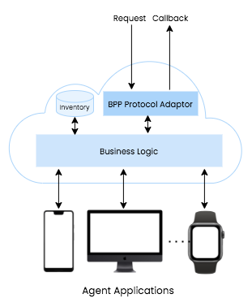

# BPP-Network

A trivial implementation of the Beckn Provider Platform (or BPP) Network layer inspired from the open source Sandbox.

BPPs are the platforms that maintain an active inventory, one or more catalogs of products and services, implement the supply logic and enable fulfillment of orders. The BPP can be a single provider with a Beckn API implementation or an aggregator of merchants — this, of course, depends upon the logic of the particular implementation.

This BPP-Network service is the Protocol Adaptor layer that we can see in the above diagram. It receives requests from Gateway and BAPs.

A BPP typically has:

- An API to accept requests from BGs or BAPs as part of the application cloud (Beckn Provider API)
= Service personnel UI. This is optional and may not be required for all cases. For example, a bike rental might not require a user interface, whereas a cab service may require a driver app.
- An application cloud to store inventory data

For more info: https://developers.becknprotocol.io/docs/introduction/transactional-layer/
